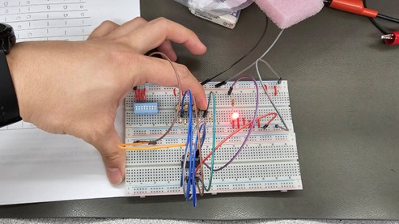
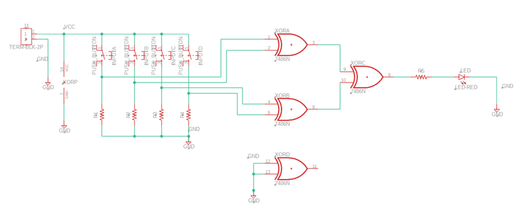
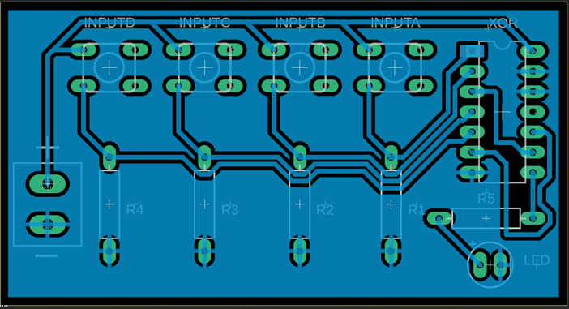
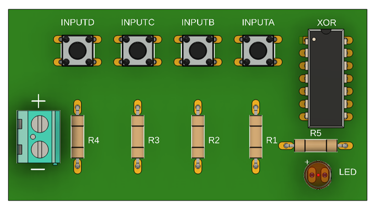
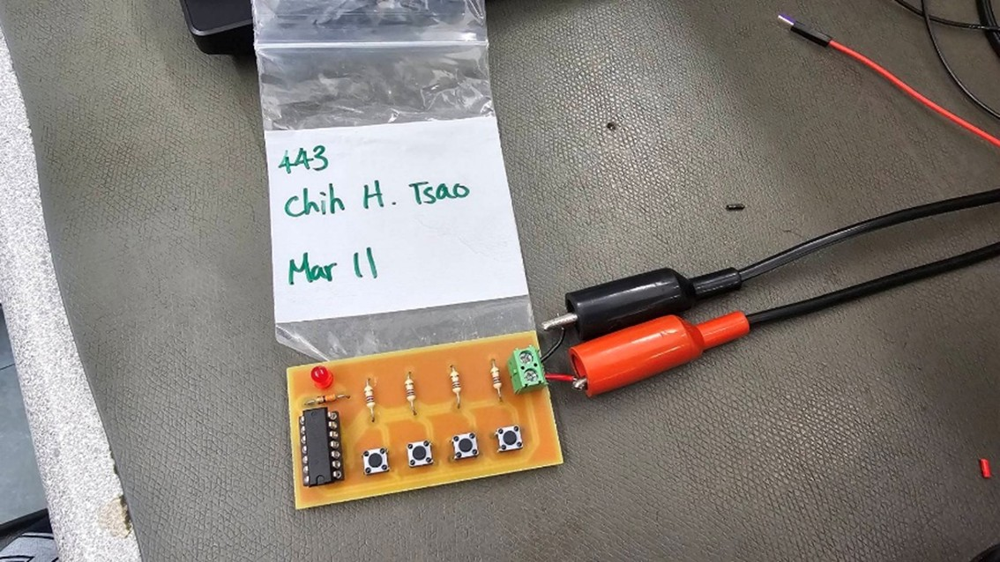
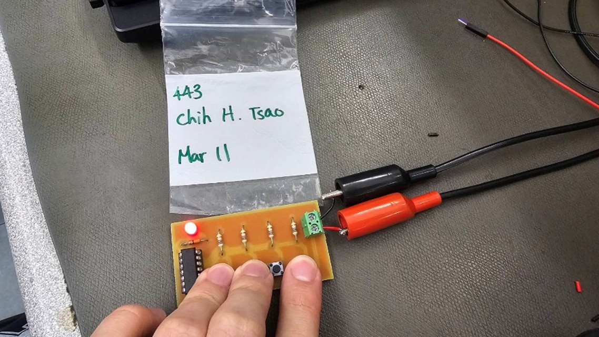
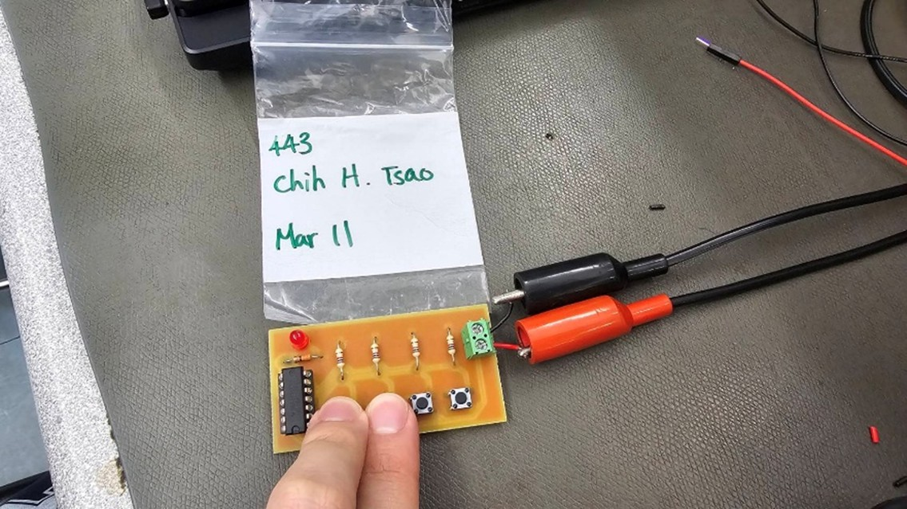

# 4-Input XOR Logic Circuit PCB Project

Digital logic circuit project completed at Seneca Polytechnic.  
This project implements a **4-input XOR logic circuit** using push-button inputs and LED output indication, with validation through breadboard testing, PCB design, and final soldered implementation.

## Highlights
- Designed and tested a **4-input XOR logic circuit**
- Verified circuit behavior against the **truth table**
- Created the schematic and PCB layout in **Fusion 360**
- Completed breadboard testing before final PCB assembly
- Improved assembly reliability by addressing solder bridging, polygon short risks, and routing/clearance tradeoffs

## Project Overview
The circuit uses four push buttons as inputs (**A, B, C, D**) and one LED as the output.  
The LED turns ON when there is an odd number of HIGH inputs, and turns OFF when there is an even number of HIGH inputs.

This project provided practical experience in:
- digital logic implementation
- breadboard validation
- schematic capture
- PCB layout
- soldering and final hardware verification

## Tools and Skills
- **Fusion 360 Electronics**
- **Digital logic design**
- **Breadboard prototyping**
- **PCB layout**
- **Truth table verification**
- **Soldering**
- **Hardware testing**
- **Troubleshooting**
- **Component placement**
- **Routing and clearance planning**

## Key Engineering Lessons
1. **Breadboard testing helps validate logic before PCB fabrication**  
   The circuit was first tested on a breadboard to confirm correct XOR behavior under different input conditions.

2. **PCB layout affects assembly reliability**  
   Larger clearances and routing decisions can reduce solder bridging risk and improve the final build quality.

3. **Documentation supports debugging and assembly**  
   Clear schematic and layout references become especially important when the final PCB does not include silkscreen labels.

## Project Images

### Breadboard Prototype

### Schematic

### PCB Layout

### 3D PCB View

### Final Soldered PCB

## Report
Full project report: [PDF](./XOR-Project-Report.pdf) | [DOCX](./XOR-Project-Report.docx)

## Resume Version
For resume use, this project can be summarized as:

> Designed, breadboard-tested, and soldered a 4-input XOR logic circuit using push-button inputs and LED output indication. Created the schematic and PCB layout in Fusion 360 and verified circuit behavior against the truth table during prototype and final-board testing. Improved assembly reliability by addressing solder bridging, polygon short risks, and routing/clearance tradeoffs during PCB fabrication.
